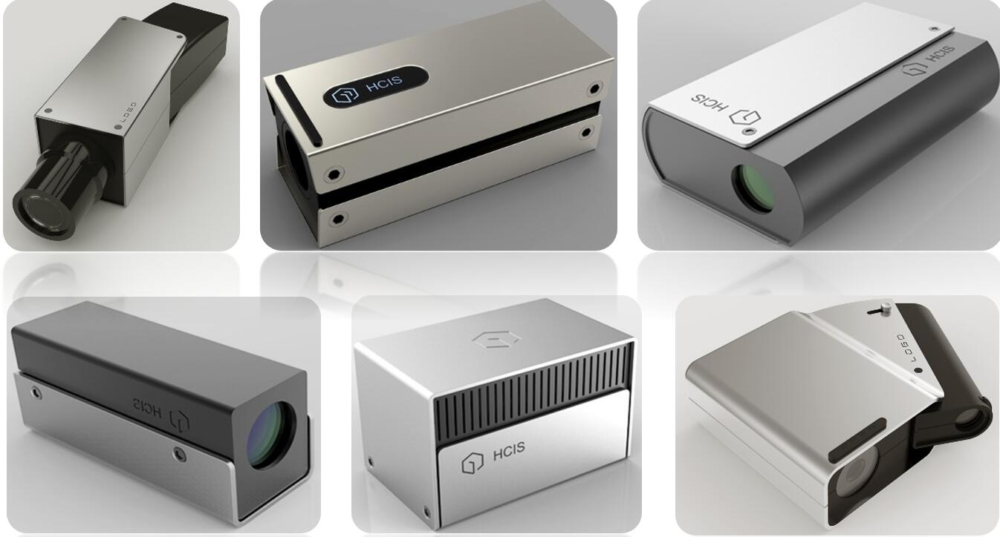
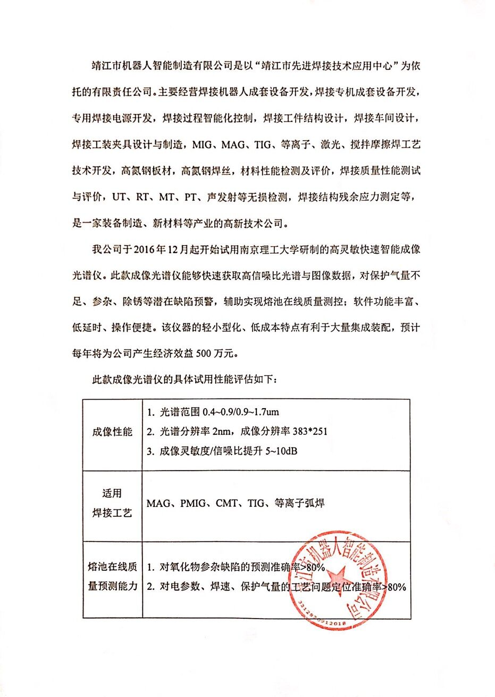

## Welcome to GitHub Pages

# Yiming Wang(王一鸣)

# On line measuring instrument for multi physical field of molten pool in fusion welding and additive forming

Major developers: Lianfa Bai, Yi Zhang, Jing Han, Zhuang Zhao, Jun Lu, Yiming Wang, Housen Xie, Chenrui Zhang, Xingwang Xu.

Jiangsu Key Laboratory of Spectral Imaging & Intelligence Sense, Nanjing University of Science and Technology, Nanjing 210094, china

 

Fusion welding and additive manufacturing technology has already penetrated into many military and people's livelihood fields, such as aerospace, weapon equipment, ship and marine engineering, new energy and new materials, nuclear equipment, automobile and rail vehicles.At present, there are some on-line measurement devices for molten pool at home and abroad, but they are mainly based on single physical quantity measurement and have low efficiency.Integrating multiple types of existing measuring instruments, there are common problems such as single measurement, low efficiency, and bulkiness.The instrument of this project will create a precedent for the integration of spectral material, 2D/3D vision, and temperature/stress measurement before and after the molten pool is solidified.

# Multi module measurement

Extend single physical quantity to multi-physical quantity measurement, integrating visual form, temperature, residual stress, and three-dimensional structure to cooperate with each other.

 

# Awards

First award in the 5th China College Students’ “Internet Plus” Innovation and Entrepreneurship Competition; 
Second award in the 11th “Challenge Cup” Jiangsu college students’ Entrepreneurship plan competition.

# Pictures

# Videos

 
<video id="video" controls="" preload="none" poster="互联网加.jpg">
      <source id="mp4" src="1.mp4" type="video/mp4">
      </video>
	  

